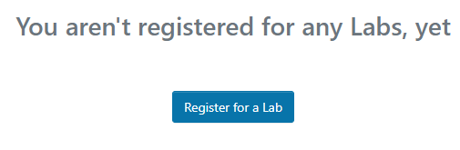
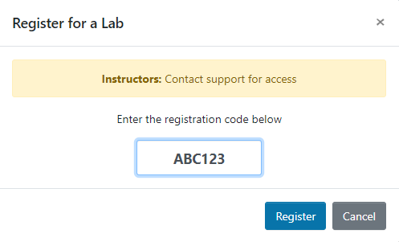
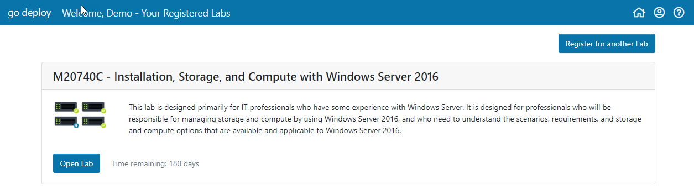

# Redeeming course codes

To redeem course codes you can simply login to the portal at [https://lms.godeploy.it](https://lms.godeploy.it/) If you do not have an account, then click the Register button on the Login page and enter your details.

Once registered and logged in then you will be presented with the following screen:

Click **Register for a Lab** then enter your unique code that you have been given and click **Register**.  

Once you have redeemed your code you will see the course in your list:

You are now ready to start your course.

If you have used go deploy labs before you will see the "Register for another Lab" button.  Click Register for another Lab and enter your code and the new lab will be added to your library.

