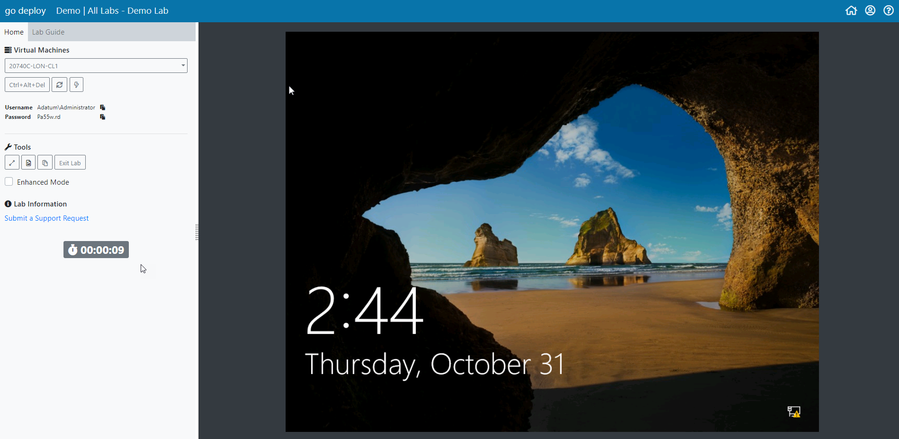

# Testing Lab Access

When courses are being run on site and not in a training center it is recommended that you carry out a test of our environment to ensure the connectivity requirements are met.  Click [here ](connectivity-requirements.md)for connectivity requirements.

To test the go deploy lab environment click the following link:



Once the user who is testing the connectivity has registered they will launch a test environment which has a simple lab setup and a demo lab guide.  The lab will be live for 15 minutes and will then end automatically.

