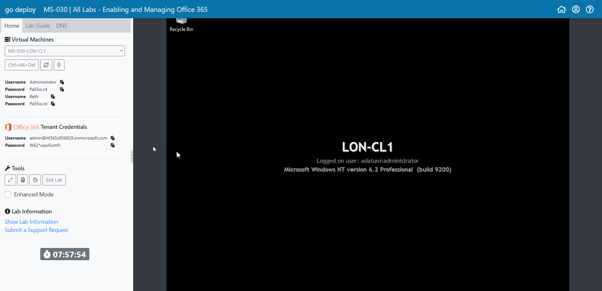

# Cannot see VM screen

If, when you launch a lab you cannot see the Virtual machine being displayed inside the lab environment then this is usually one of three issues.  

1. You are not using an up to date browser that we support.
2. You are behind a corporate firewall that is blocking the connection.
3. You have a VPN connected.



When the resolution of your machine is too low you may sometimes experience an issue of not being able to see the full virtual machine screen as per the screenshot below:

You have a few options to rectify this issue.

1. Change the display settings on your physical machine to a higher resolution.
2. Change the resolution of the VM you are connected to \(this may hinder your labs as you will not be able to see everything on open windows and have to scroll up and down.
3. Zoom out of the browser.  To do this see the options below: 
   * **Chrome**  Click the **Ellipsis** button \(**...**\) and click **Zoom** 
   * **Edge**  Click the **Ellipsis** button \(**...**\) and click **Zoom**

Change the zoom settings to suit your requirement and now you should now be able to see the full Virtual Machine screen:

