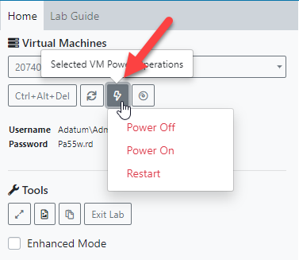
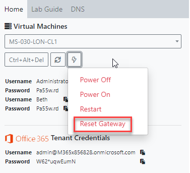

# Connectivity Issues

Regularly our support channel is contacted regarding the performance of labs.  On most occasions this occurs due to latency or a minor network contention issue at the location where the training event is taking place.

**Since the advent of Coronavirus \(Covid-19\) there has been an increased number of home/remote users connecting to the lab environment.  We have more than enough capacity to cope with the connections however here are some tips to ensure the labs function as expected.**

1. **Check you do not have a VPN Connected**
2. **Ensure you have available bandwidth \(other household users streaming live content in HD will have an impact on your connectivity to our lab platform.**
3. **Use a wired connection rather than a WiFi connection.**

The reason this occurs is because the VM window inside the LMS is continually live and connections are open.  If this is interrupted, then this can produce symptoms that the VM is no longer responding.

There is a simple fix for this.  Simple click the "**Reconnect**" button inside the of the lab window to attempt a fresh connection to the lab environment.

If the Virtual Machine has become unresponsive then you should try restarting the VM by using the Power Options Button:

If internet connectivity is lost then attempt resetting the gateway which provides such connectivity:

