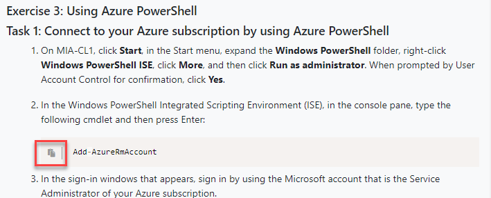

# Pasting

We have tried to make the pasting process as simple and intuitive as possible but this guide will outline the steps required to paste information directly into the VM.

## Pasting from within lab guides

1. When pasting commands from within lab guides you simply just click the paste icon to type the command into the active window inside the virtual machine.

## Pasting from external content

1. Ensure the windows you wish to paste into is active inside the VM \(for example Notepad / Command Prompt or PowerShell\) as this is where the text will be pasted.

2. Copy the text from your local machine / lab guide / web page / file.

3.  Navigate back to the LMS and click the Paste button under Tools:

4.  You can either press "Ctrl + V" or paste or right click the green area and click paste.  

5.  The content is now pasted inside of the VMs and the paste feature is automatically reset, to paste additional content you will need to activate the paste feature again.

