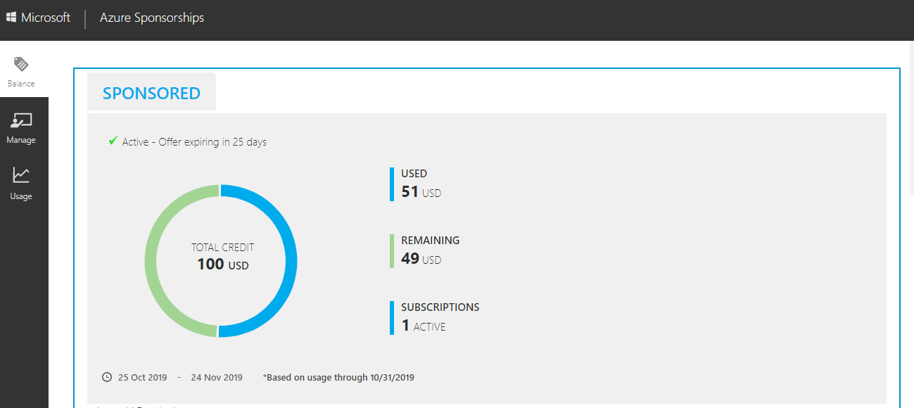

# Azure Pass balance

There has been a change in the Azure Pass offer recently. The Microsoft Azure Pass is now on a Sponsorship. This is part of the process of consolidating Microsoft Azure offers. As a result of this offer Microsoft is retiring legacy Azure Pass offers and launching a new Azure Pass offer. You will notice this change as you navigate through anything related to the subscription. The subscription owner is still an admin and can deploy available resources just like the legacy offer.

To check the remaining Azure credit balance, you will need to check this at [https://www.microsoftazuresponsorships.com/](https://nam06.safelinks.protection.outlook.com/?url=https%3A%2F%2Fwww.microsoftazuresponsorships.com%2F&data=02%7C01%7CJim.Cochran%40microsoft.com%7C06625f5a61524475f6b008d65ee5fa48%7C72f988bf86f141af91ab2d7cd011db47%7C1%7C0%7C636800739183909083&sdata=C3xclf6SBR9yfu0wvvYrTn3P9sPg%2BkDvDQRRuN%2FHulA%3D&reserved=0)

Click Sign In and sign in with your Azure Pass subscription credentials.

You will see how much credit you have remaining.

