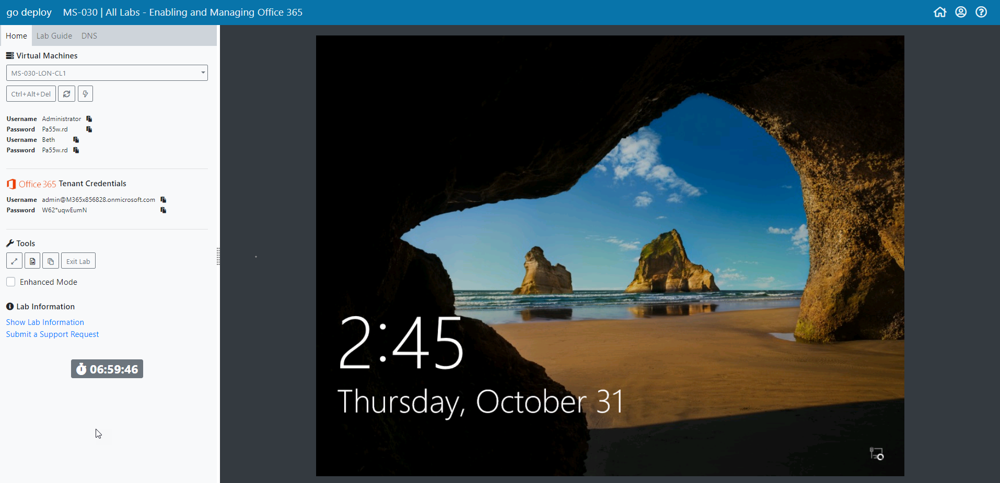
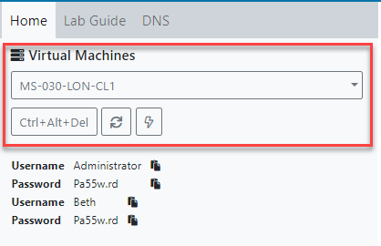
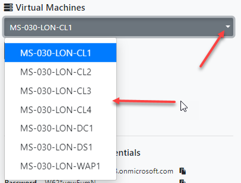
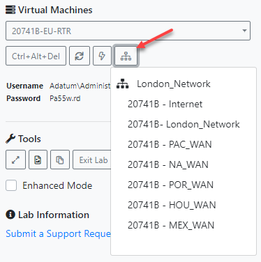
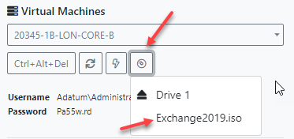
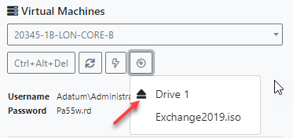
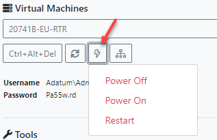
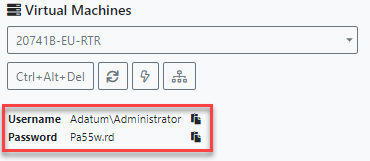
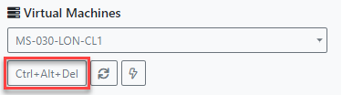

# Using the Lab Interface

This article and diagram below should assist you in understanding the different functionality within the LMS. Depending on the functionality required within your lab, you may not see each option for every lab environment.

## **Main LMS environment**

## **Virtual Machine control area**

### **Virtual Machines selection menu**

This is where you select the different virtual machines available for your lab.

### **Virtual Switch selection menu**

When labs require machines to be moved to another switch \(or network\) then this option is displayed.

### **Media Selection menu**

When labs require ISO images to install software, the ISO image will be available here to select. There is also an eject button.

You can also eject the media by selecting the eject button.

### **Power menu**

The power menu enables you to turn On / Off and force reboot Virtual Machines.

You also have the ability to reset the gateway machine that is hidden from users but provides internet connectivity. Rebooting the gateway takes around 30 seconds therefore it is advised that you do not keep sending the reset command or the virtual machine will never complete booting.

### **Username and Password**

The username and password for the selected VM is displayed here. On occasions where labs require users to login with multiple accounts then only the main username and password will be displayed.

### **Username and Password paste feature**

Note the small paste button next to the Username and Password upon clicking the username paste button it will insert the username into the Virtual Machine username box \(if selected\) and automatically tab to the Password field.

By clicking the password paste feature it will automatically paste the password into the password field and press enter for you.

### **Refresh Display Button**

On rare occasions where the VM window becomes unresponsive then click the Refresh Display button. This re-establishes a connection with the selected Virtual Machine.

### **Control + Alt + Delete Button**

The Ctrl + Alt + Del button simply sends the sequence to the selected virtual machine.

## Office 365 / Dynamics 365 Credentials

For labs that require Office 365 / Dynamics 365 Credentials the pre provisioned tenant credentials are displayed.


Ending and relaunching your lab will allocated you a new tenant.


## **Tools area**

### Full Screen

The full screen button will change your browser to full screen mode.

### **Screenshot**

By selecting the screenshot button it will take a screenshot of the selected VM area and enable you to save the file.

### **Paste Function**

Paste function button **Activates** the paste feature into the selected virtual machine. You should copy the contents you wish to copy, activate the paste feature then use Ctrl V to paste into the virtual machine.

### **End and Save lab button**

When you have completed your lab you should end your lab. If you wish to continue you lab at another time then ensure you click the save button. Labs will saved between 4 and 7 days depending on the lab environment. Not all labs can or need to be saved.

### **Lab Guides**

The majority of courses have lab guides integratedin the lab environment. You can find them by simply clicking the "Lab Guide" tab in the top left hand corner of your screen.

Some courses have multiple lab guides. You can move onto the next lab by clicking the drop down menu.

There is a tool that allows you to resize the Guide to Lab window ratio so you can extend either if necessary.

You also have the option to view the lab guide in a seperate web browser window, ideal if you have two monitors available as it creates more room to view your lab environment.

