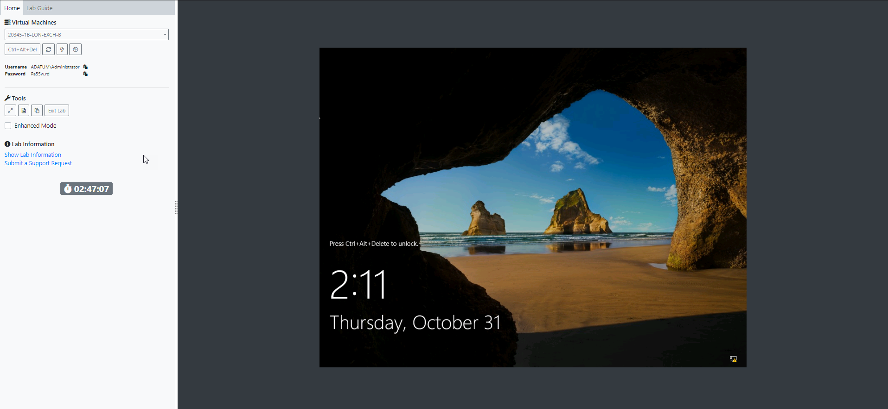
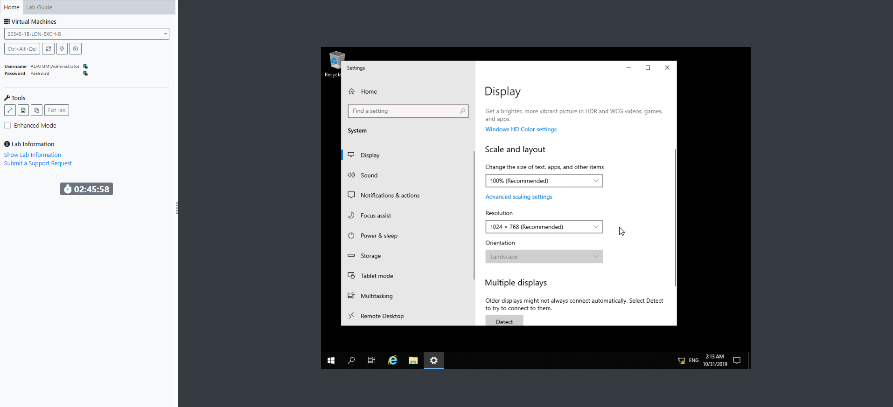
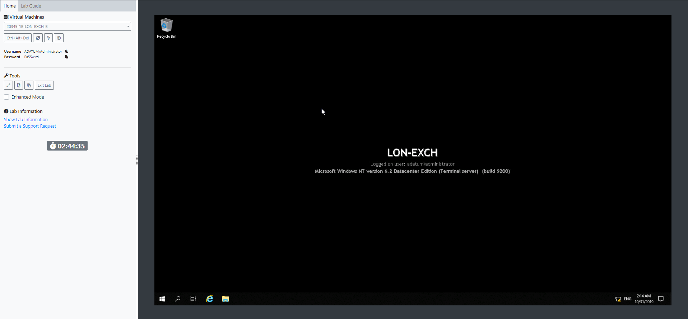

# Virtual Machine Resolution

When a lab is launched it will have a default resolution that the content author decided on.  This may not fill your screen depending on the size of monitor and the resolution of your local machine.

You can easily change this by right clicking on the virtual machine desktop &gt; Display Settings &gt; Resolution &gt; Select the resolution that best meets your requirements

You will then have a larger working area for your virtual machine.

If you select a resolution that is too high for your screen you will need to reduce it to a smaller resolution otherwise aspects of the Virtual machine will not be displayed.

Simply select a smaller resolution and click Keep Changes or Apply.


**Note:**  These settings are not saved and will need to be applied to each VM and lab launch.


